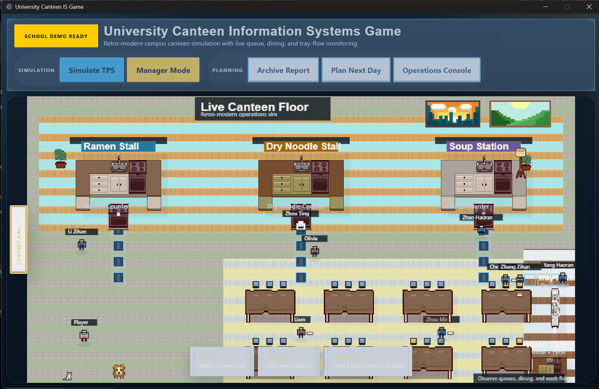

# Information System Simulator Demo


*阅读其他语言版本: [English](README.md)*



**维护者：** Yusi（[boygotflames](https://github.com/boygotflames)）

**仓库地址：** [Information-System-Simulator-Demo](https://github.com/boygotflames/Information-System-Simulator-Demo)

## 项目愿景与教学价值

这个项目的目标，是把信息系统课程中常见但抽象的概念变得可见、具体、可交互。项目通过一个 2D 大学校园食堂模拟场景，把排队、路径流动、交易处理、用餐流程、餐盘回收、运营报表、计划决策和现场监控放到同一个可观察的环境里。它不再把信息系统当成纯理论，而是展示人员、流程、数据、软件与日常运营决策如何在真实系统中相互连接。

作为教学演示，它帮助学生理解：现实中的信息系统并不是孤立的软件界面，而是一个完整的运营生态。通过同时观察食堂现场和管理面板，学习者可以把课堂中的概念与实际系统行为建立联系。

## 功能概览

- 实时食堂楼层模拟，包含玩家移动、服务档口、用餐区域与餐盘回收流程
- 可视化的排队与移动行为，帮助展示运营瓶颈与路径流动
- 从点餐、入座、用餐到回收餐盘和离场的完整就餐生命周期
- 用于监控排队、销售、库存、报表和计划决策的管理面板与运营控制台
- 将游戏中的行为映射到信息系统核心概念，如人员、流程、软件、数据与决策支持
- 轻量级浏览器架构，并支持 Electron 便携版打包，适合演示使用

## 快速开始

如果你只是想在 Windows 上运行这个项目，请直接使用便携式桌面版本，而不是克隆仓库。

1. 打开发布页面：[1.0.0 版本 Release](https://github.com/boygotflames/Information-System-Simulator-Demo/releases/tag/1.0.0)
2. 下载 **`University Canteen IS Game-1.0.0-portable.exe`**
3. 可以把它放到桌面、普通文件夹或 U 盘中
4. 双击即可启动

这个版本是即开即用的，**不需要安装**。

如果 Windows SmartScreen 弹出提示，请在确认文件来源可信后点击 **More info** 再继续运行。

## 开发者与贡献者

你可以先克隆仓库，再用自己习惯的编辑器打开，并使用简单的本地服务器在浏览器中测试。项目本身保持轻量，因此 Python 自带的本地服务器是一个很实用的默认方案。

```bash
git clone https://github.com/boygotflames/Information-System-Simulator-Demo.git
cd Information-System-Simulator-Demo
python -m http.server 8000
```

然后使用 Google Chrome 打开：

```text
http://localhost:8000
```

如果你希望测试打包后的桌面外壳，仓库也支持基于 Electron 的 Windows 便携版构建。

## 项目结构

- `index.html`：Web 主入口
- `css/`：界面样式与外壳布局
- `js/`：模拟逻辑、渲染层、控制器与系统代码
- `assets/`：仓库内的图像资源、精灵图与视觉素材
- `docs/`：文档与面向仓库展示的支持文件

## 项目目录树

```text
Information-System-Simulator-Demo/
├── assets/
│   ├── sprites/
│   │   ├── pets/
│   │   │   ├── cat/
│   │   │   │   └── Cat Sprite Sheet.png
│   │   │   └── dog/
│   │   │       └── 48DogSpriteSheet.png
│   │   ├── props/
│   │   │   └── decorations_LRK.png
│   │   └── ui/
│   │       ├── Kenny/
│   │       │   └── 9-Slice/
│   │       │       ├── Ancient/
│   │       │       │   ├── brown.png
│   │       │       │   ├── brown_inlay.png
│   │       │       │   ├── brown_pressed.png
│   │       │       │   ├── grey.png
│   │       │       │   ├── grey_inlay.png
│   │       │       │   ├── grey_pressed.png
│   │       │       │   ├── tan.png
│   │       │       │   ├── tan_inlay.png
│   │       │       │   ├── tan_pressed.png
│   │       │       │   ├── white.png
│   │       │       │   ├── white_inlay.png
│   │       │       │   └── white_pressed.png
│   │       │       ├── Colored/
│   │       │       │   ├── blue.png
│   │       │       │   ├── blue_pressed.png
│   │       │       │   ├── green.png
│   │       │       │   ├── green_pressed.png
│   │       │       │   ├── grey.png
│   │       │       │   ├── grey_pressed.png
│   │       │       │   ├── red.png
│   │       │       │   ├── red_pressed.png
│   │       │       │   ├── yellow.png
│   │       │       │   └── yellow_pressed.png
│   │       │       ├── Outline/
│   │       │       │   ├── blue.png
│   │       │       │   ├── blue_pressed.png
│   │       │       │   ├── green.png
│   │       │       │   ├── green_pressed.png
│   │       │       │   ├── red.png
│   │       │       │   ├── red_pressed.png
│   │       │       │   ├── yellow.png
│   │       │       │   └── yellow_pressed.png
│   │       │       ├── list.png
│   │       │       ├── space.png
│   │       │       └── space_inlay.png
│   │       └── Spritesheet/
│   │           ├── UIpackSheet_magenta.png
│   │           └── UIpackSheet_transparent.png
│   └── tiles/
│       ├── floor/
│       │   └── floorswalls_LRK.png
│       ├── interior/
│       │   ├── cabinets_LRK.png
│       │   ├── kitchen_LRK.png
│       │   └── livingroom_LRK.png
│       └── walls/
│           └── doorswindowsstairs_LRK.png
├── css/
│   └── style.css
├── docs/
│   ├── images/
│   │   └── pixel_art_large.png
│   └── educational-mapping.md
├── electron/
│   └── main.js
├── js/
│   ├── core/
│   │   ├── Counterbehaviorprofile.js
│   │   ├── ExecutiveReportEngine.js
│   │   ├── game.js
│   │   ├── InformationSystemController.js
│   │   ├── InputHandler.js
│   │   ├── LocalStateRepository.js
│   │   ├── OperationalPlanningEngine.js
│   │   ├── renderer.js
│   │   ├── RestockEngine.js
│   │   └── ServiceRulesEngine.js
│   ├── data/
│   │   ├── canteenLayout.js
│   │   ├── collisionLayout.js
│   │   ├── diningAreaLayout.js
│   │   ├── inspectables.js
│   │   ├── LayoutConstants.js
│   │   ├── namePools.js
│   │   ├── recipeBook.js
│   │   ├── recipes.js
│   │   ├── restockProfiles.js
│   │   ├── stallCatalog.js
│   │   ├── stalls.js
│   │   └── tutorials.js
│   ├── entities/
│   │   ├── Cook.js
│   │   ├── Manager.js
│   │   ├── PlayerAvatar.js
│   │   ├── PosTerminal.js
│   │   ├── Server.js
│   │   └── Student.js
│   ├── rendering/
│   │   ├── assetInventory.js
│   │   ├── CharacterRenderer.js
│   │   ├── EnvironmentRenderer.js
│   │   ├── palette.js
│   │   ├── renderSkin.js
│   │   ├── ShadowRenderer.js
│   │   ├── spriteLoader.js
│   │   ├── spriteRegistry.js
│   │   ├── VisualTheme.js
│   │   └── WorldRenderer.js
│   ├── systems/
│   │   ├── CanvaInspector.js
│   │   ├── CollisionSystem.js
│   │   ├── InteractionSystem.js
│   │   ├── NpcPathRouter.js
│   │   ├── QueueSystem.js
│   │   ├── StudentDiningFlowSimulator.js
│   │   └── TrayReturnSystem.js
│   ├── ui/
│   │   └── dashboardToggle.js
│   └── main.js
├── index.html
├── LICENSE
├── package-lock.json
├── package.json
├── README.md
└── README_zh-CN.md
```

## 开源与许可

这是一个开源项目。你可以在 MIT License 的许可范围内自由 fork、学习、修改、改编，并将其重新制作成适合自己教学或实践用途的版本。完整许可内容请参见 [LICENSE](LICENSE) 文件。

项目署名：由 Yusi（[boygotflames](https://github.com/boygotflames)）维护。
